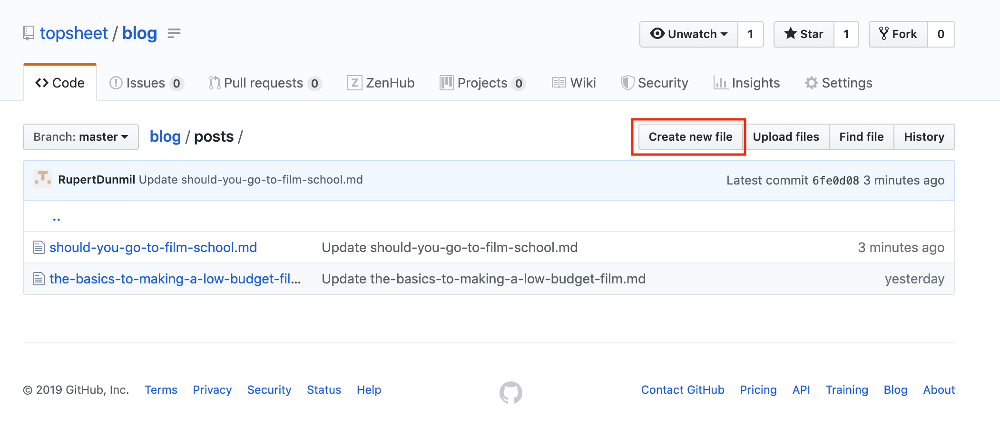
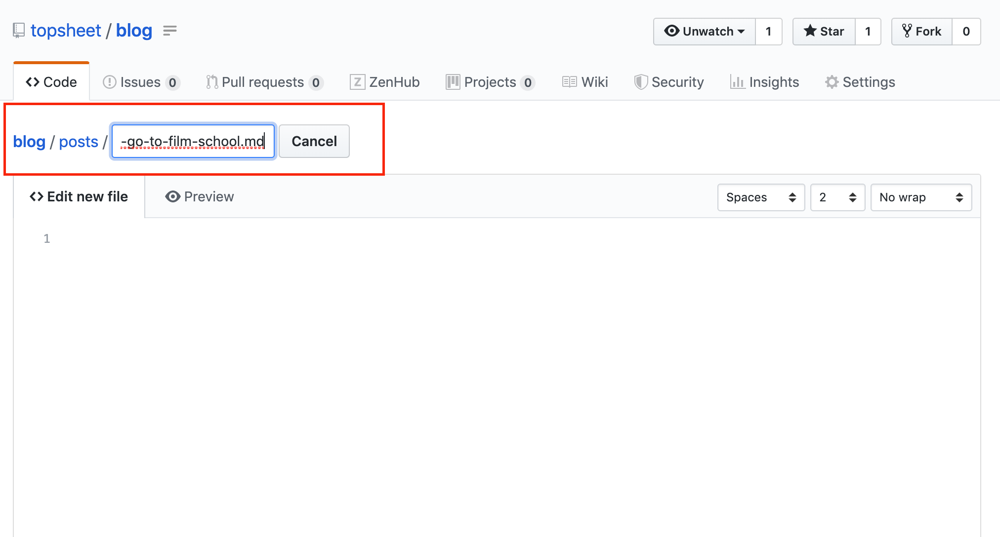
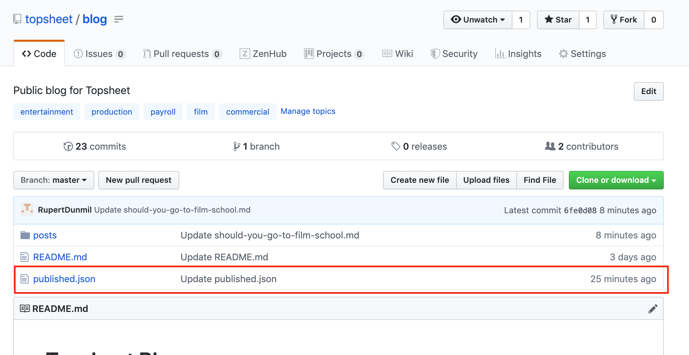
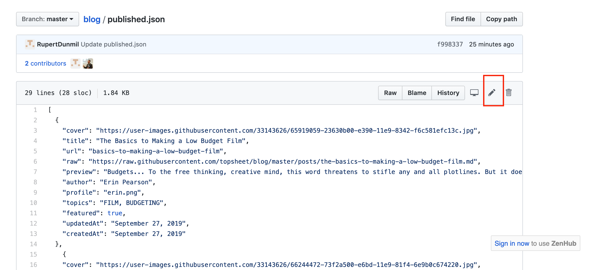

# Topsheet Blog


### Submitting A Blog

Once you have completed a blog, in **Mardown Format** submit a blog, first click on the folder `posts` then click on button in the top right corner `Create new file`.  



At the top left of the body, there is a empty box that says `Name your file...` in that field type the title of your blog, but do it in a format with **No Spaces** , spaces should be replaced with `-` as well as there should be **NO capital letters**. At the end of the title, type `.md`, so your final project should look something like this `this-is-my-title.md`. This will become the URL of the blog.



In the body paste your Markdown Formated blog, then click `Commit new file`.


### Formatting Your Blog

The format of your blog needs to be in **Markdown Format** , for more information on that, please follow this [link](https://www.markdownguide.org/basic-syntax/#emphasis).

To check your work you can post it in a new file on this Github repository, then click `Preview changes`, or use this [site](https://markdownlivepreview.com).

Adding images can be a little hard for new users of Markdown, but a simple way is to download the images you are wanting to post, then just drag and drop it in the body of the file you have created here, then move the line where you want it to be placed, preview to check your work (to preiveiw, you must have your file titled with the `.md`). When adding an image the the Markdown format should look somethign like this 

``

### Publishing it to the Website

The last step to publishing the blog will be clicking on `published.json` in the root and clicking on the pencil to edit this file.




This file dictates the blogs that get displayed by the website.

It looks something like this:

```
[
  {
    "cover": "https://user-images.githubusercontent.com/33143626/65919059-23630b00-e390-11e9-8342-f6c581efc13c.jpg",
    "title": "The Basics to Making a Low Budget Film",
    "url": "basics-to-making-a-low-budget-film",
    "raw": "https://raw.githubusercontent.com/topsheet/blog/master/posts/the-basics-to-making-a-low-budget-film.md",
    "preview": "Budgets... To the free thinking, creative mind, this word threatens to stifle any and all plotlines. But it doesn’t have to be that way. There are many advantages of making low budget films. They allow you to tell a unique story that doesn’t have to homogenize itself to hit every global market, instead it can be released to a niche market and have a great effect. The point of low budget filmmaking is not to compete with the big studios. Instead, create for the overlooked markets",
    "author": "Erin Pearson",
    "profile": "erin.png",
    "topics": "FILM, BUDGETING",
    "featured": true,
    "updatedAt": "September 27, 2019",
    "createdAt": "September 27, 2019"
  },
    {
    "cover": "https://user-images.githubusercontent.com/33143626/66244472-73f2a500-e6bd-11e9-81f4-6e9b0c674220.jpg",
    "title": "Should You Go to Film School?",
    "url": "should-i-go-to-film-school",
    "raw": "https://raw.githubusercontent.com/topsheet/blog/master/posts/should-you-go-to-film-school.md",
    "preview": "Let’s set the scene. You have labored over your career choices. You have been pestered by nearly every adult you have come into contact with over the last 2 years: What are you doing after high school?, What are you going to study in college? At long last, you have decided… Film. I want to go into film.”",
    "author": "Erin Pearson",
    "profile": "erin.png",
    "topics": "FILM, EDUCATION",
    "featured": true,
    "updatedAt": "October 4, 2019",
    "createdAt": "October 4, 2019"
  }
]
```

Let's break down what each item means:

- **cover**: The cover image of the blog. You can grab the URL of the image from your GitHub view (e.g. https://github.com/topsheet/blog/blob/master/posts/should-you-go-to-film-school.md).
- **title**: The official name of the blog post.
- **url**: This is the SEO-friendly URL for Google to index
- **raw**: The raw URL of the file. You can grab this by clicking `Raw` button on your GitHub view.
- **preview**: A short synopsis, ideally under 160 characters, about your blog to hook the read.
- **author**: Your name.
- **profile**: Your picture, probably `erin.png`.
- **topics**: A comma-separated list of topics for what you are discussing.
- **featured**: Whether this blog is going to be featured 
- on the main blog page, either a `true` or `false` value.
- **updatedAt**: The date you last updated it.
- **createdAt**: The date you first created it.

Follow the format of the previous JSON blobs and add it to the end of the file. It will now be displayed on the website!

